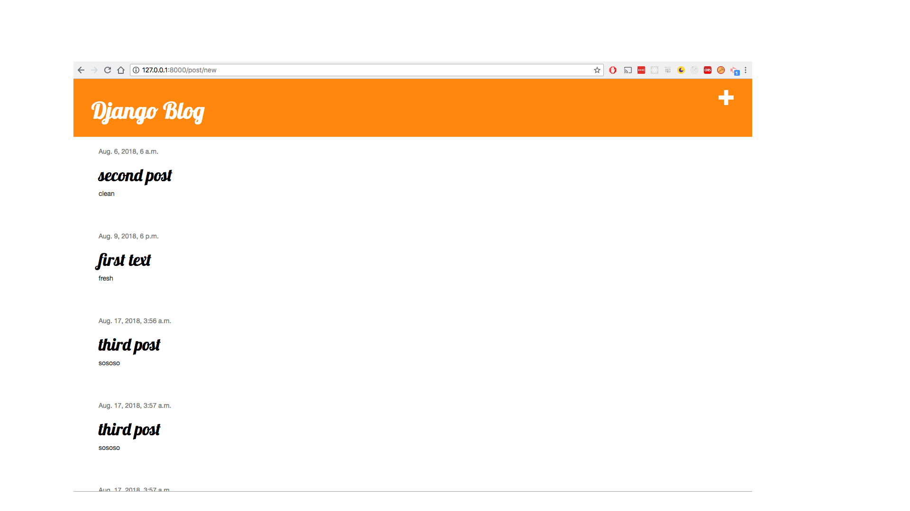
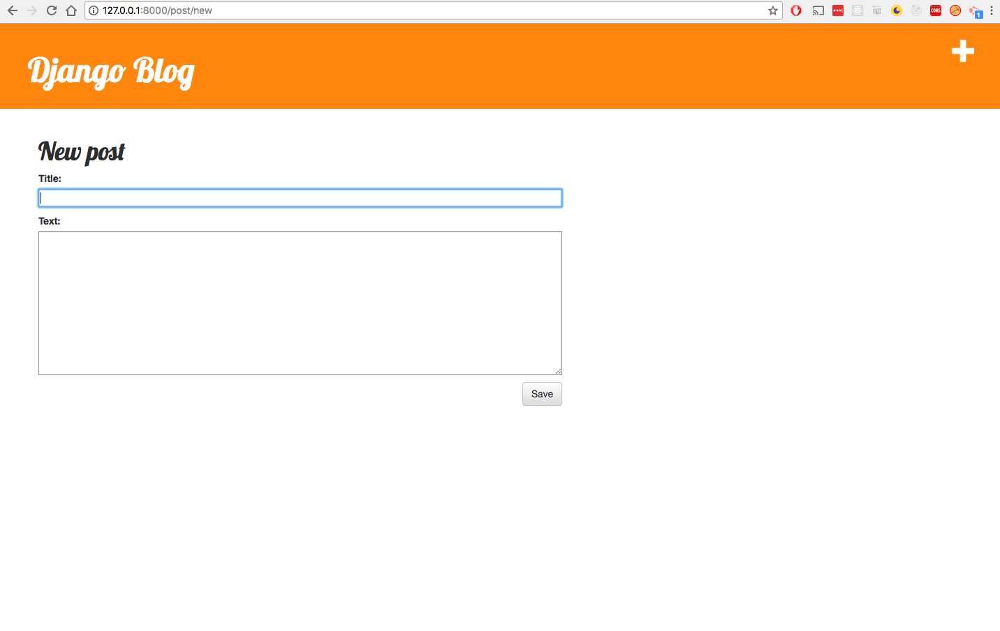
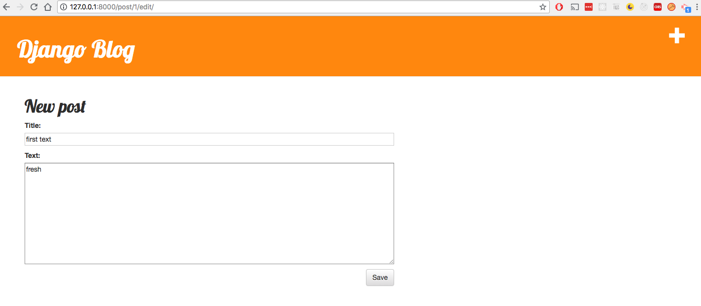

# Django Blog -- How to start your own 

> virtualenv venv -p python3 && venv/bin/activate && pip install -r requirements.txt

> python manage.py createsuperuser	-- then 127.0.0.1:8000/admin log into admin then add a post 

> python manage.py makemigrations blog		-- tells you what changed in models.py

> python manage.py migrate blog		-- applies new changes in models.py

> python manage.py runserver 127.0.0.1:8000	

### http://127.0.0.1:8000/	-- see all posts 

### http://127.0.0.1:8000/post/new	-- form to create new post

### http://127.0.0.1:8000/post/2/edit/		-- if post exists

### http://127.0.0.1:8000/post/2/  -- doesn't work yet 

##### https://tutorial.djangogirls.org/en/django_forms/

